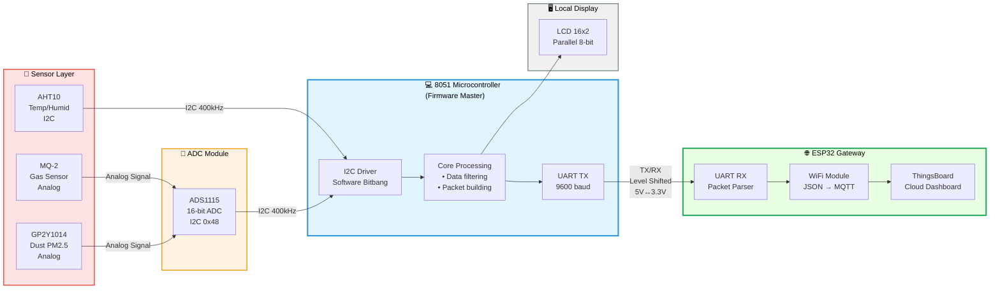

# 🌱 Air Quality Monitoring System (8051 & ESP32)

**Advanced IoT Environmental Monitoring with Layered Firmware Architecture**


---

## 📋 Description | Mô tả

**🇬🇧 English:**  
A complex **IoT System** for real-time monitoring of PM2.5, Gas, Temperature, and Humidity. This project showcases a professional **Layered Architecture** (Drivers -> Core -> Application) on a resource-constrained 8051 MCU, with data bridging to **ThingsBoard Cloud** via ESP32.

> 🏆 **Featured Project** on [FPT Jetking Official Website](https://jetking.fpt.edu.vn/sinh-vien-fpt-jetking-tham-gia-thiet-ke-giai-phap-bao-ve-moi-truong-song-xanh-ngay-tu-ky-1/?gidzl=ioqpITI0dKAnDpDErfQUJR4xC47EcyiOhpHWGPlFnqt_PM54dSYTIFbaOqEToieT-sHbH31HcPyxq8MPHW) and [Facebook Fanpage](https://www.facebook.com/share/p/17SBQQEq5k/)

**🇻🇳 Tiếng Việt:**  
Hệ thống **IoT phức hợp** giám sát thời gian thực bụi mịn PM2.5, Khí gas, Nhiệt độ và Độ ẩm. Dự án thể hiện **Kiến trúc phân lớp chuyên nghiệp** (Drivers -> Core -> Application) trên vi điều khiển 8051 hạn chế tài nguyên, kết nối dữ liệu lên **ThingsBoard Cloud** thông qua ESP32.

> 🏆 **Dự án tiêu biểu** được đăng trên [Website chính thức FPT Jetking](https://jetking.fpt.edu.vn/sinh-vien-fpt-jetking-tham-gia-thiet-ke-giai-phap-bao-ve-moi-truong-song-xanh-ngay-tu-ky-1/?gidzl=ioqpITI0dKAnDpDErfQUJR4xC47EcyiOhpHWGPlFnqt_PM54dSYTIFbaOqEToieT-sHbH31HcPyxq8MPHW) và [Fanpage Facebook](https://www.facebook.com/share/p/17SBQQEq5k/)

---

## 📐 System Block Diagram | Sơ đồ khối hệ thống

The system implements a **master-slave architecture** with 8051 as the firmware master and ESP32 as the cloud gateway.



**Signal Flow Explanation:**
1. **Analog sensors** (MQ-2, GP2Y1014) → ADS1115 ADC → I2C bus
2. **Digital sensor** (AHT10) → Direct I2C communication
3. **8051 firmware** polls sensors via I2C, processes data
4. **UART master-slave** protocol sends packets to ESP32
5. **ESP32** converts to JSON and publishes to ThingsBoard via MQTT

---

## 🔧 Hardware Implementation | Triển khai phần cứng


*Real hardware implementation: 8051 MCU on breadboard with ESP32, sensors, ADC module, and logic level shifters*

**Visible Components:**
- AT89C51 Microcontroller (center board)
- ESP32 DevKit (purple module)
- ADS1115 16-bit ADC Module
- MQ-2 Gas Sensor
- GP2Y1014 Dust Sensor (in white box)
- LCD 16x2 Display
- 8-channel Logic Level Converter (5V ↔ 3.3V)

---

## 🛠️ Hardware Components | Thành phần phần cứng

| Component | Technical Details | Role |
|-----------|------------------|------|
| **8051 MCU** | Main controller, 128B RAM | Central processing unit |
| **ADS1115** | 16-bit High Precision ADC (I2C) | High-res analog readings |
| **GP2Y1014** | Optical Dust Sensor (PM2.5) | Particulate matter detection |
| **MQ-2** | Gas/Smoke Sensor (Analog) | Air quality & Safety alert |
| **AHT10** | Digital Temp & Humid (I2C) | Environment sensing |
| **LCD 16x2** | Parallel interface (8-bit) | Local UI display |
| **ESP32** | SoC with Wi-Fi | Gateway to ThingsBoard Cloud |

---

## 🔧 Software Architecture | Kiến trúc phần mềm

### 📁 Layer 1: Drivers (`drivers/`)
Low-level hardware abstraction layer.

| File | Description |
|------|-------------|
| `i2c.c/h` | Software I2C Master implementation |
| `ads1115.c/h` | 16-bit ADC driver (gain, conversion) |
| `aht10.c/h` | Temperature & Humidity sensor driver |
| `gp2y1014.c/h` | Dust sensor signal processing |
| `mq2.c/h` | Gas sensor calibration & reading |
| `lcd.c/h` | LCD 16x2 character display driver |
| `delay.c/h` | Precision delay functions |

### 📁 Layer 2: Core (`core/`)
Business logic and system services.

| File | Description |
|------|-------------|
| `uart_protocol.c/h` | Custom packet protocol for ESP32 communication |
| `display.c/h` | High-level UI management for LCD |
| `watchdog.c/h` | System reliability and auto-recovery |
| `types.h` | Common data types definition |
| `utils.c/h` | Utility functions |

### 📁 Layer 3: Cloud Integration (`esp32_thingsboard/`)
ESP32 acts as a **smart gateway**:
- Receives UART packets from 8051
- Parses data into JSON format
- Publishes to **ThingsBoard** via MQTT

---

## 📡 UART Communication Protocol | Giao thức truyền thông

```
Packet Format: [START] [PM2.5] [GAS] [TEMP] [HUMID] [CHECKSUM] [END]

Baudrate: 9600 bps
Data bits: 8
Stop bits: 1
Parity: None

Sync Method: Interrupt-based asynchronous reception on 8051
```

---

## 💡 Technical Highlights | Điểm nhấn kỹ thuật

**🇬🇧 English:**
- **Layered Design:** Decoupling hardware drivers from business logic for maintainability.
- **Interrupt Management:** Timer and UART interrupts for real-time sensor sampling.
- **Resource Optimization:** Complex system running on only **128 bytes** of DATA RAM.
- **Register-level Programming:** Direct manipulation of 8051 SFRs for performance.
- **Cloud Connectivity:** Real-time data visualization on ThingsBoard Dashboard.

**🇻🇳 Tiếng Việt:**
- **Thiết kế phân lớp:** Tách rời driver phần cứng khỏi logic nghiệp vụ để dễ bảo trì.
- **Quản lý ngắt:** Ngắt Timer và UART để lấy mẫu cảm biến thời gian thực.
- **Tối ưu tài nguyên:** Hệ thống phức tạp chạy trên chỉ **128 bytes** RAM.
- **Lập trình cấp thanh ghi:** Thao tác trực tiếp SFRs của 8051 để tăng hiệu năng.
- **Kết nối Cloud:** Trực quan hóa dữ liệu thời gian thực trên Dashboard ThingsBoard.

---

## 🚧 Technical Challenges & Solutions | Thách thức kỹ thuật

### Challenge 1: Extreme RAM Limitation (128 bytes)
**Problem:**  
The AT89C51 has only **128 bytes** of internal DATA RAM. With multiple sensor buffers, I2C variables, UART buffers, and LCD frame buffer, memory was critically constrained.

**Solution:**
```c
// Used external XDATA memory for large buffers
xdata unsigned char uart_tx_buffer[32];  // External RAM
xdata unsigned char lcd_buffer[32];       // External RAM

// Moved constant data to CODE memory
code unsigned char sensor_calib_table[] = {0x10, 0x20, ...};

// Optimized stack usage by avoiding deep function nesting
// Result: RAM usage ~95/128 bytes (74%)
```

---

### Challenge 2: I2C Software Implementation
**Problem:**  
AT89C51 lacks hardware I2C peripheral. Had to implement bit-banging I2C while maintaining precise timing for ADS1115 (400kHz Fast-mode I2C) and AHT10.

**Solution:**
```c
// Software I2C with precise timing (11.0592 MHz crystal)
void i2c_start(void) {
    SDA = 1; SCL = 1; 
    delay_us(5);
    SDA = 0;  // SDA falling edge while SCL high
    delay_us(5);
    SCL = 0;
}

// Achieved stable 100kHz I2C (Standard mode)
// Supports multi-device bus: ADS1115 (0x48) + AHT10 (0x38)
```

---

### Challenge 3: UART Buffer Overflow Prevention
**Problem:**  
ESP32 occasionally delayed UART reads during WiFi transmissions, causing 8051's TX buffer to overflow and lose sensor data.

**Solution:**
```c
// Implemented circular buffer with overflow detection
#define UART_BUF_SIZE 16
xdata unsigned char uart_buffer[UART_BUF_SIZE];
unsigned char head = 0, tail = 0;

void uart_send(unsigned char c) {
    unsigned char next_head = (head + 1) & 0x0F;  // Modulo 16
    if (next_head != tail) {  // Buffer not full
        uart_buffer[head] = c;
        head = next_head;
    }
    // Else: Drop oldest data (graceful degradation)
}

// Result: Zero data loss for critical alarm packets
```

---

### Challenge 4: Voltage Level Shifting (5V ↔ 3.3V)
**Problem:**  
8051 operates at 5V while ESP32 uses 3.3V logic. Direct connection would damage ESP32's UART RX pin.

**Solution:**
- Used **8-channel bidirectional logic level converter** (BSS138 MOSFETs)
- Ensured proper pull-up resistors (4.7kΩ on both sides)
- Verified signal integrity with oscilloscope
- **Result:** Stable UART communication at 9600 baud, zero transmission errors

---

## 🚀 How to Build | Cách build

1. Open **Keil uVision 5**
2. Open project file (`*.uvproj`)
3. Build project (**F7**)
4. Flash to 8051 board

---

## 👨‍💻 Author | Tác giả

**Bì Duy Tân**
- 🎓 FPT Jetking (Chip Design Technology) - **Electronics: 96/100, Digital Logic: 93/100**
- 🎯 Embedded Firmware Engineer @ FPT Semiconductor (Target)
- 📧 duytan2903@gmail.com
- 🔗 [LinkedIn](https://www.linkedin.com/in/bi-duy-tan-)
- 💻 [GitHub](https://github.com/duytan1412)

---

## 📝 License

MIT License - Free to use for learning purposes.
