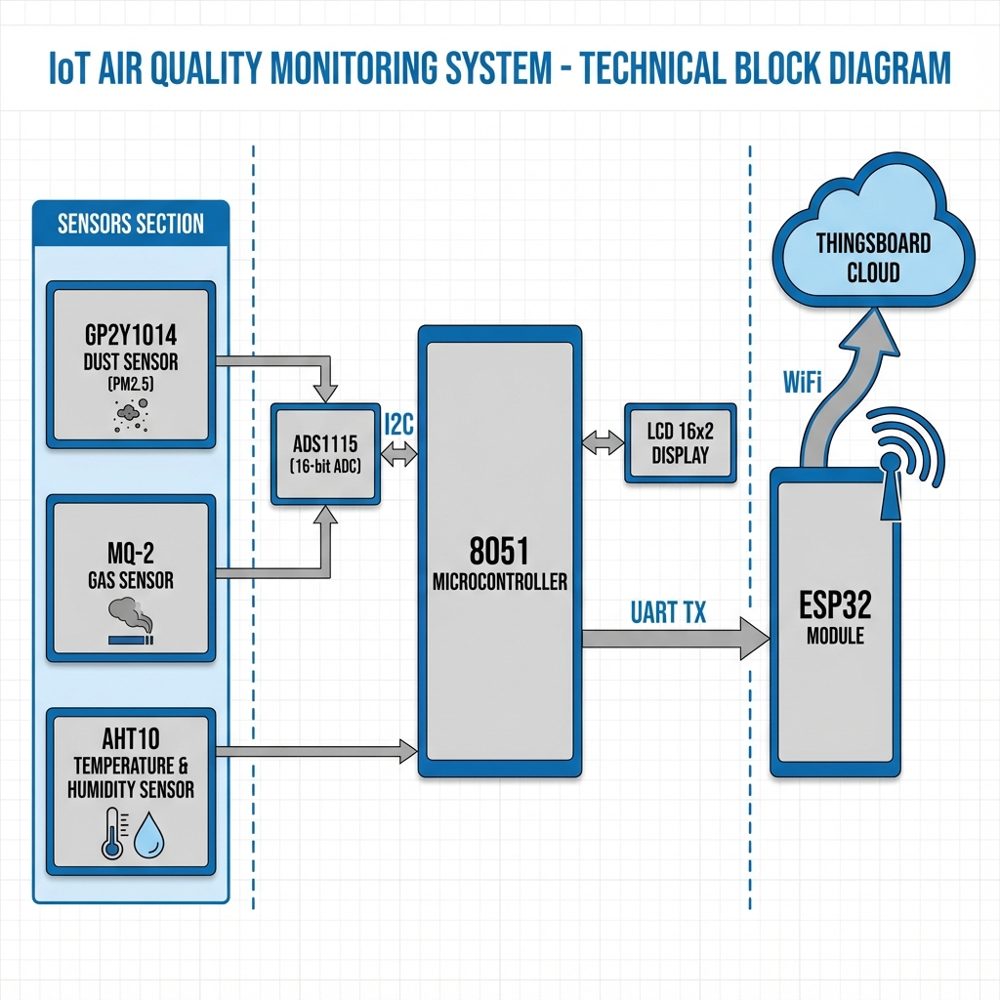

# 🌱 Air Quality Monitoring System (8051 & ESP32)

**Advanced IoT Environmental Monitoring with Layered Firmware Architecture**


---

## 📋 Description | Mô tả

**🇬🇧 English:**  
A complex **IoT System** for real-time monitoring of PM2.5, Gas, Temperature, and Humidity. This project showcases a professional **Layered Architecture** (Drivers -> Core -> Application) on a resource-constrained 8051 MCU, with data bridging to **ThingsBoard Cloud** via ESP32.

> 🏆 **Featured Project** on [FPT Jetking Official Fanpage](https://www.facebook.com/share/p/17SBQQEq5k/)

**🇻🇳 Tiếng Việt:**  
Hệ thống **IoT phức hợp** giám sát thời gian thực bụi mịn PM2.5, Khí gas, Nhiệt độ và Độ ẩm. Dự án thể hiện **Kiến trúc phân lớp chuyên nghiệp** (Drivers -> Core -> Application) trên vi điều khiển 8051 hạn chế tài nguyên, kết nối dữ liệu lên **ThingsBoard Cloud** thông qua ESP32.

> 🏆 **Dự án tiêu biểu** được đăng trên [Fanpage chính thức FPT Jetking](https://www.facebook.com/share/p/17SBQQEq5k/)

---

## 📐 System Block Diagram | Sơ đồ khối hệ thống



---

## 🛠️ Hardware Components | Thành phần phần cứng

| Component | Technical Details | Role |
|-----------|------------------|------|
| **8051 MCU** | Main controller, 128B RAM | Central processing unit |
| **ADS1115** | 16-bit High Precision ADC (I2C) | High-res analog readings |
| **GP2Y1014** | Optical Dust Sensor (PM2.5) | Particulate matter detection |
| **MQ-2** | Gas/Smoke Sensor (Analog) | Air quality & Safety alert |
| **AHT10** | Digital Temp & Humid (I2C) | Environment sensing |
| **LCD 16x2** | Parallel interface (8-bit) | Local UI display |
| **ESP32** | SoC with Wi-Fi | Gateway to ThingsBoard Cloud |

---

## 🔧 Software Architecture | Kiến trúc phần mềm

### 📁 Layer 1: Drivers (`drivers/`)
Low-level hardware abstraction layer.

| File | Description |
|------|-------------|
| `i2c.c/h` | Software I2C Master implementation |
| `ads1115.c/h` | 16-bit ADC driver (gain, conversion) |
| `aht10.c/h` | Temperature & Humidity sensor driver |
| `gp2y1014.c/h` | Dust sensor signal processing |
| `mq2.c/h` | Gas sensor calibration & reading |
| `lcd.c/h` | LCD 16x2 character display driver |
| `delay.c/h` | Precision delay functions |

### 📁 Layer 2: Core (`core/`)
Business logic and system services.

| File | Description |
|------|-------------|
| `uart_protocol.c/h` | Custom packet protocol for ESP32 communication |
| `display.c/h` | High-level UI management for LCD |
| `watchdog.c/h` | System reliability and auto-recovery |
| `types.h` | Common data types definition |
| `utils.c/h` | Utility functions |

### 📁 Layer 3: Cloud Integration (`esp32_thingsboard/`)
ESP32 acts as a **smart gateway**:
- Receives UART packets from 8051
- Parses data into JSON format
- Publishes to **ThingsBoard** via MQTT

---

## 📡 UART Communication Protocol | Giao thức truyền thông

```
Packet Format: [START] [PM2.5] [GAS] [TEMP] [HUMID] [CHECKSUM] [END]

Baudrate: 9600 bps
Data bits: 8
Stop bits: 1
Parity: None

Sync Method: Interrupt-based asynchronous reception on 8051
```

---

## 💡 Technical Highlights | Điểm nhấn kỹ thuật

**🇬🇧 English:**
- **Layered Design:** Decoupling hardware drivers from business logic for maintainability.
- **Interrupt Management:** Timer and UART interrupts for real-time sensor sampling.
- **Resource Optimization:** Complex system running on only **128 bytes** of DATA RAM.
- **Register-level Programming:** Direct manipulation of 8051 SFRs for performance.
- **Cloud Connectivity:** Real-time data visualization on ThingsBoard Dashboard.

**🇻🇳 Tiếng Việt:**
- **Thiết kế phân lớp:** Tách rời driver phần cứng khỏi logic nghiệp vụ để dễ bảo trì.
- **Quản lý ngắt:** Ngắt Timer và UART để lấy mẫu cảm biến thời gian thực.
- **Tối ưu tài nguyên:** Hệ thống phức tạp chạy trên chỉ **128 bytes** RAM.
- **Lập trình cấp thanh ghi:** Thao tác trực tiếp SFRs của 8051 để tăng hiệu năng.
- **Kết nối Cloud:** Trực quan hóa dữ liệu thời gian thực trên Dashboard ThingsBoard.

---

## 🚀 How to Build | Cách build

1. Open **Keil uVision 5**
2. Open project file (`*.uvproj`)
3. Build project (**F7**)
4. Flash to 8051 board

---

## 👨‍💻 Author | Tác giả

**Bì Duy Tân**
- 🎓 FPT Jetking (Featured Student Project)
- 🎯 Embedded Firmware / IoT Developer
- 📧 duytan2903@gmail.com
- 🔗 [LinkedIn](https://www.linkedin.com/in/duy-t%C3%A2n-b-439ba0153/)
- 💻 [GitHub](https://github.com/duytan1412)

---

## 📝 License

MIT License - Free to use for learning purposes.
