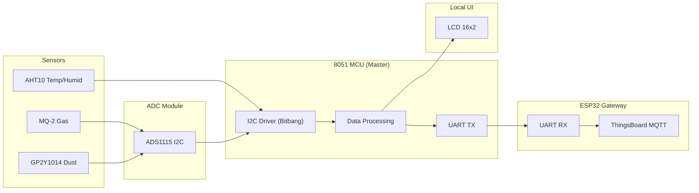
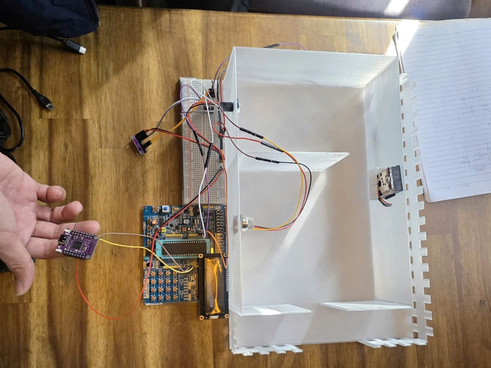

# Air Quality Monitoring System

A firmware project that implements environmental monitoring using an 8051 microcontroller as the primary processing unit and an ESP32 as an IoT gateway.

The system gathers data from multiple analog and digital sensors, processes it under severe memory constraints (128B RAM), and formats it into UART packets. The ESP32 parses these packets and forwards them to a ThingsBoard cloud dashboard via MQTT.

## Architecture


```mermaid
flowchart LR
    subgraph Sensors["Sensors"]
        MQ2[MQ-2 Gas]
        DUST[GP2Y1014 Dust]
        AHT[AHT10 Temp/Humid]
    end
    
    subgraph ADC["ADC Module"]
        ADS[ADS1115 I2C]
    end
    
    subgraph MCU["8051 MCU (Master)"]
        I2C_DRV["I2C Driver (Bitbang)"]
        CORE["Data Processing"]
        UART_TX["UART TX"]
    end
    
    subgraph Display["Local UI"]
        LCD["LCD 16x2"]
    end
    
    subgraph Gateway["ESP32 Gateway"]
        UART_RX["UART RX"]
        CLOUD["ThingsBoard MQTT"]
    end
    
    MQ2 --> ADS
    DUST --> ADS
    AHT --> I2C_DRV
    ADS --> I2C_DRV
    
    I2C_DRV --> CORE
    CORE --> LCD
    CORE --> UART_TX
    
    UART_TX --> UART_RX
    UART_RX --> CLOUD
```

## System Components

- **MCU**: AT89C51 (8051 architecture)
- **Gateway**: ESP32-S2 Mini
- **Sensors**: 
  - AHT10 (I2C Digital Temperature & Humidity)
  - GP2Y1014 (Analog PM2.5 Optical Dust Sensor)
  - MQ-2 (Analog Gas/Smoke Sensor)
- **ADC**: ADS1115 (16-bit, 4-channel, I2C)
- **Display**: LCD 16x2 (Parallel 8-bit interface)

## Firmware Structure

The 8051 firmware is written in C and compiled using Keil µVision 5. It is divided into layers:

1. **Drivers (`drivers/`)**: Low-level hardware interfaces, including a custom software I2C implementation (bit-banged at ~100kHz) to support the AHT10 and ADS1115 modules.
2. **Core (`core/`)**: High-level application logic. Combines sensor readings, handles fault detection, manages the LCD UI, and formats UART telemetry packets.
3. **Gateway (`esp32_thingsboard/`)**: Contains the `.ino` sketch for the ESP32 to bridge UART data continuously to the ThingsBoard platform.

## Communication Protocol

The 8051 communicates with the ESP32 over a unidirectional UART link at 9600 baud. The data is transmitted as JSON strings:
```json
{"T":28.5,"H":65.0,"P":35.0,"G":120,"E":0}
```

## Building

1. Open `Smart Room.uvproj` in Keil µVision 5.
2. Build Output (F7). Hex file will be under `Objects/` directory.
3. Flash the generated Hex to the 8051 using your preferred programmer.
4. For the Gateway, flash `esp32_thingsboard.ino` to the ESP32 using the Arduino IDE.

## Hardware Reference


*Real hardware implementation on breadboard.*

## License
MIT License.
